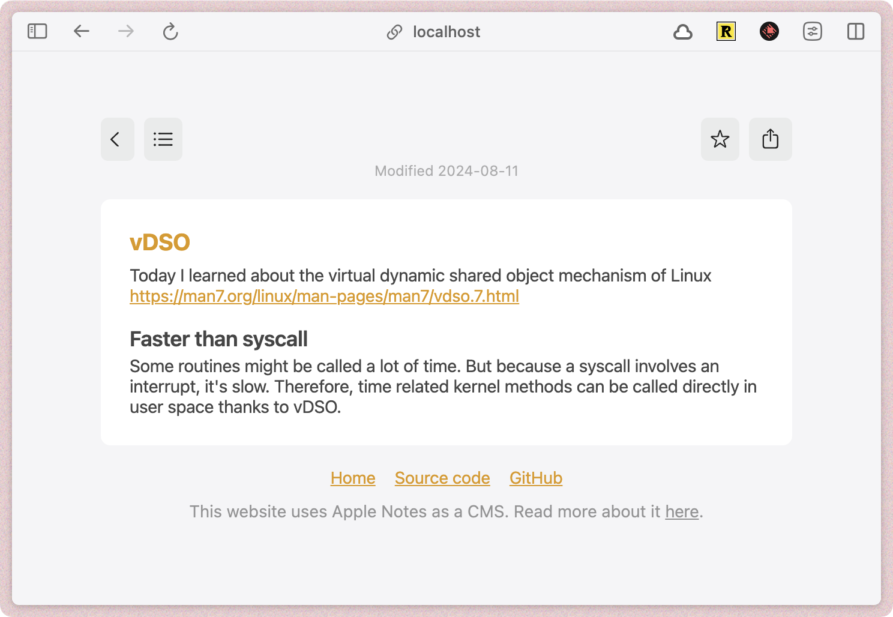

# Apple notes as a CMS

This is a simple blog that uses Apple Notes as a CMS. It's a proof of concept that uses [Anyquery](https://anyquery.dev) to query the notes and display them as a blog.

You can see a live example at [https://til.julienc.me](https://til.julienc.me).

## What is anyquery?

Anyquery is a SQL query engine that runs on pretty much any data source. It allows you to query data from different sources like Apple Notes, Google Sheets, Notion, and more.

## How it works

The blog is an Astro project that uses SQL to query the notes. The notes are then stored as `notes.json` in the root of the project. The notes are then loaded by the Astro project and displayed as a blog.

This is only on macOS as it uses Apple Notes.

## Setup

1. Clone the repo
2. Run `npm install` or `pnpm install`
3. Install [Anyquery](https://anyquery.dev/docs/#installation)
4. Install the Apple Notes plugin for Anyquery. Run `anyquery plugin install notes`
5. Run `exportNotes.sh` to export the notes to `notes.json`
6. Run `npm run build` or `pnpm run build` to build the project

You can edit `src/config.js` to change the title of the blog and the footer text.

Running `./deploy.sh` will build the project and deploy it to Vercel.

## License

The project is licensed under the MIT license. See the [LICENSE](LICENSE.md) file for more information.

## Contributing

Contributions are welcome! Feel free to open an issue or a pull request.
